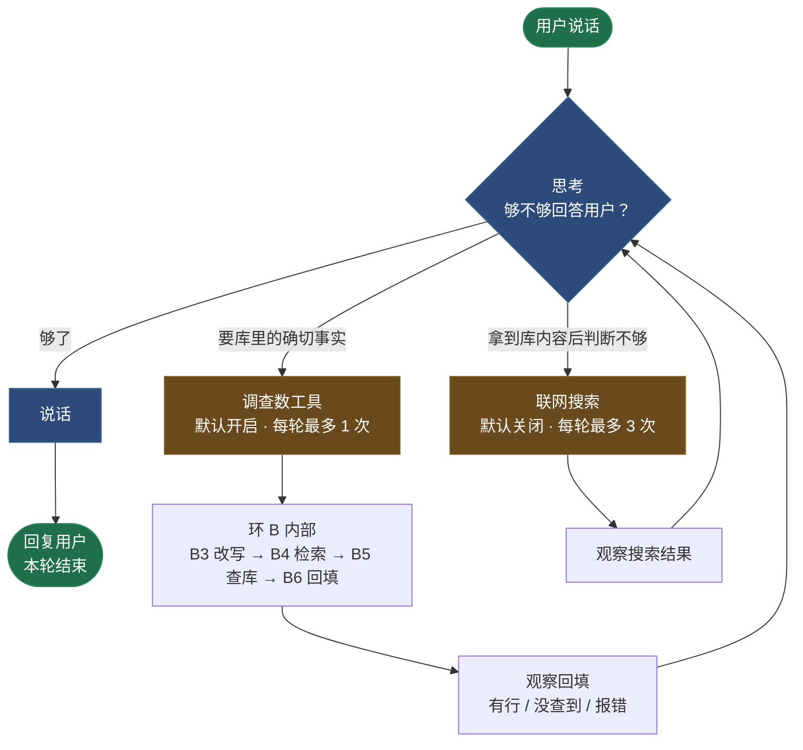
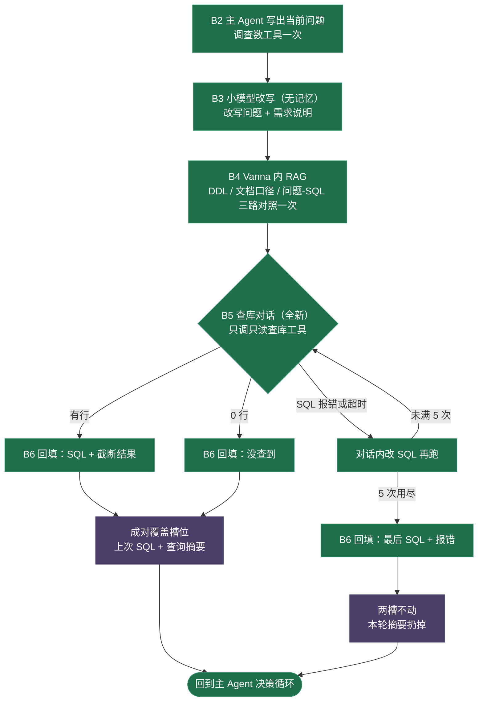
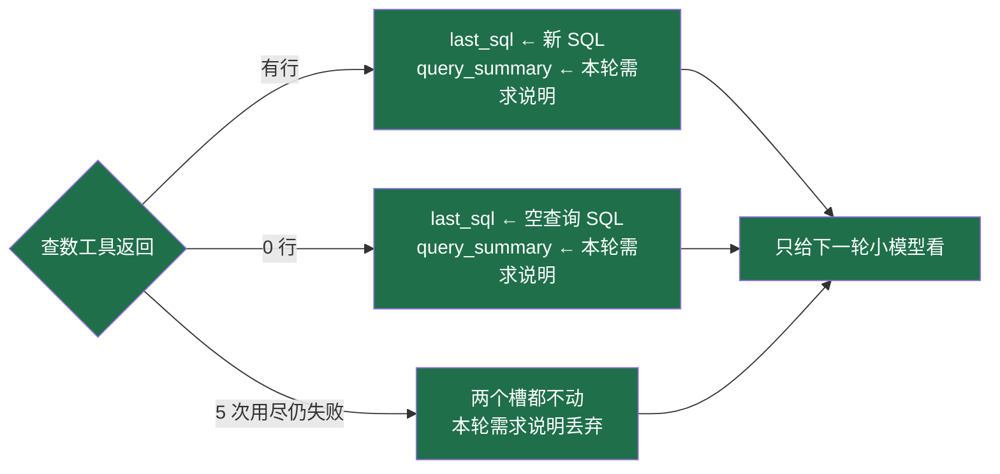

# Text-SQL 主 Agent · 流程图

本图只画**设计**。哪些已经接线、哪些还是替身，见 `README.md` 的「哪些是真接通的」一节；实现边界见 `START-HERE.md`。

配套的设计正文在仓库根目录 `textsql-agent-flow.md`，HTML 版在 `textsql-agent-flow.html`。

---

## 一、主 Agent 是一个决策循环

每一圈只问一句话：**「手上这些材料，够不够回答用户？」**

**读法**：`调查数工具` 和 `联网搜索` 都会回到「思考」，而不是直接结束本轮。所以一轮里可以查完库、判断不够、再联网搜，最后才说话。

### 三条边界

1. **改写不归主 Agent。** 它只写出「当前问题」交给查数工具，改写问题全部由工具内部的小模型产出。
2. **联网搜索不在环 B 内。** 它不封装进查数工具，也不是环 A 的专利——是主 Agent 自己的一个动作，典型发生在拿到查数回填之后。
3. **被拒的工具不打断整轮。** 查数工具用超了、或搜索熔断用尽，程序把那个工具从主 Agent 能看见的工具集里摘掉，循环继续，让它用手上已有的回填说话；始终没开口才兜底。

---

## 二、环 B：查数工具内部

主 Agent 调一次工具即进入，跑完回填、离开环 B。它插不了步。

**0 行也算查库成功**，所以照写成对覆盖；只有「5 次用尽仍失败」才是两槽不动。

---

## 三、槽位：唯一一处程序写状态

硬约束：**成对覆盖**——只有查库成功才把两个槽一起写，失败就原样返回。富化结果和搜索结果都**不进槽位**。

---

## 四、已定的数字

| 项 | 值 |
|---|---|
| 查数工具 | 默认开启，每轮最多 1 次 |
| 每段查库对话最多只读调用 | 5 |
| 单次 SQL 超时 | 30 秒 |
| 回填截断 | 50 行或约 4000 字 |
| 联网搜索 | 默认关闭；主 Agent 在拿到库内容后按需调用 |
| 联网搜索开启后：每轮最多调用 | 3 |
| 联网搜索开启后：单次超时 | 15 秒 |
| 主 Agent 决策循环上限 | 3 + 3 = 6 |

> 回填截断值在 `flow-design.md`（§4，写 `LIMIT 200` → 截到 10 行）与规格 + 现状代码（50 行 / 4000 字）之间对不上，尚未拍板。本图按现状代码画。
